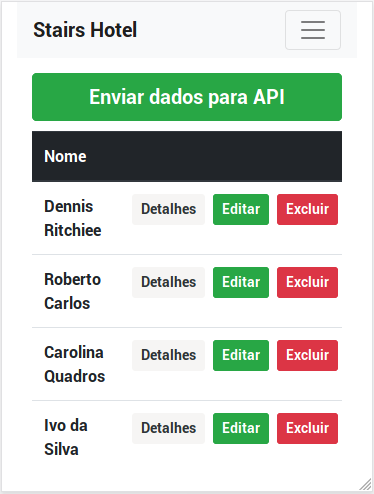

# StairsFrontend

This is my solution to the frontend challenge for Stairs Studio.
The goal was to create an app that could register and manage guests at a hotel.

It uses Angular 8 and Bootstrap.

## Development server

Run `ng serve` for a dev server. Navigate to `http://localhost:4200/`. The app will automatically reload if you change any of the source files.

## Deploying

To deploy, run `ng build --prod`, and specify `dist/[project-name]` as the publish directory

## Live Version

I deployed the app on netlify to make the challenge review easier.

It can be accessed on [stairs-frontend-challenge.netlify.com](https://stairs-frontend-challenge.netlify.com/).

## Screenshots

